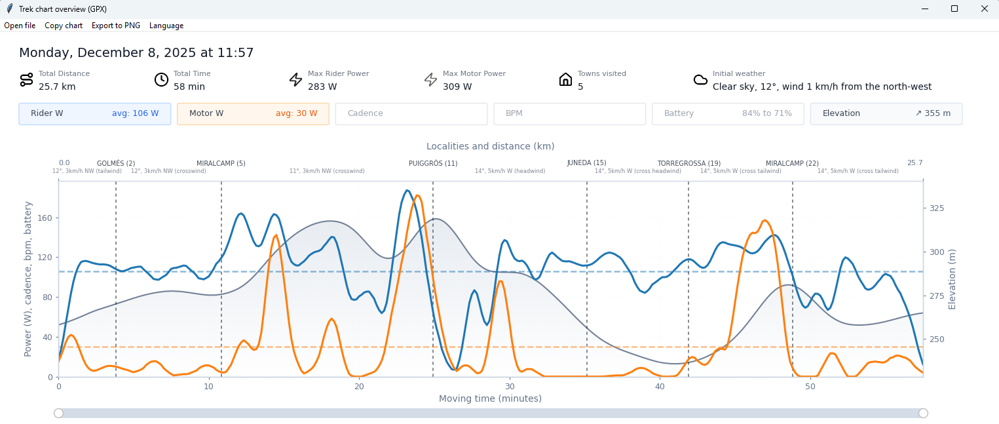
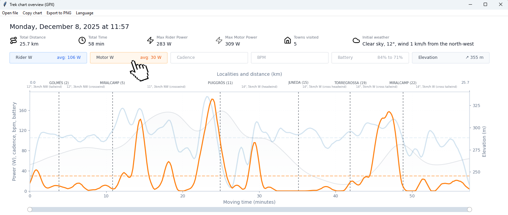
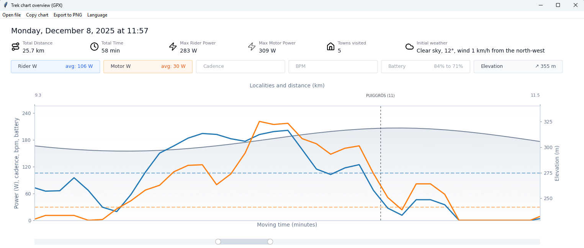

# Trek Ride Snapshot 🚴⚡📈

**All your Trek ride metrics, in one chart.**

A desktop GPX dashboard for Trek rides. Compare **rider vs motor power** with smoothing, see **battery** and **heart rate** when available, and get **elevation**, **moving time**, and **distance** in a single clean chart.

> Built with **Tkinter + Matplotlib**.

---

## ✨ Features

- ⚡ **Rider vs motor power** with smoothing (easy to read, less noise)
- 🧾 **Dashboard header** with key stats (distance, moving time, max rider/motor power)
- 🧩 **Metric pills** (Rider / Motor / HR / Battery / Elevation) showing quick KPIs
- 🖱️ **Toggle visibility:** click any pill to show/hide its series (great to declutter)
- 🧼 **Focus mode on hover:** hover a pill to dim everything else and highlight that metric
- 🧭 **Hover tooltip:** move the mouse over the chart to see time, distance, elevation and values at that point
- 🏘️ **Localities on the route:** reverse-geocoded town markers on the distance axis (optional weather notes)
- 🌬️ **Wind context:** shows wind direction relative to your heading when weather is available
- 🔎 **Zoom & pan:** use the bottom range slider to zoom in/out and navigate along the ride timeline
- 📈 **Adaptive smoothing on zoom:** less smoothing as you zoom into shorter distance ranges
- ⛰️ **Elevation profile** as a subtle gradient background layer (with its own right Y axis)
- ⏱️ **Moving time** (stops removed) on the main X-axis
- 🛣️ **Distance (km)** on the top X-axis
- 📉 **Mean power** lines for rider and motor
- 🔋 **Battery line** (when present) + **assist level markers** (1–3) on mode changes
- ❤️ **Heart rate line** (when present)
- 📋 **Copy chart to Windows clipboard**
- 🖼️ **Export to PNG**
- 🌍 **Multi-language UI** via `languages/*.json` translation files (remembers last language)
- 😅 **No speed on purpose:** speed doesn’t play nicely with the ranges of the other metrics. This chart is designed first and foremost to compare **rider vs. motor power** (plus battery/HR/elevation) without squeezing everything into unreadable scales.

---

## 🧠 How it works (overview)

- Parses GPX trackpoints (`time`, `ele`, `lat`, `lon`)
- Reads Trek-related extension fields:
  - required: `power`, `motor_power`
  - optional: `ebike_battery`, `heartrate`, `ebike_mode`
- Computes distance (Haversine) and derives speed
- Detects long stops (≥ 60s with near-zero speed and both powers at 0) and removes them from **moving time**
- Resamples data every **10 seconds** of active time
- Reverse-geocodes localities along the route (cached in `geocode_cache.json`)
- Fetches weather snapshots for the start and localities, and classifies wind vs heading
- Applies smoothing:
  - Power: **7-point + 5-point** moving average (edge-preserving)
  - Elevation: light smoothing
  - Battery / HR: smoothed when present (NaNs interpolated when possible)
- Adjusts smoothing based on zoomed distance span (none <1 km; light 1-3; medium 3-7; heavy >7)
- Detects assist-mode changes and collapses rapid toggles (<30s) into a single final marker

---

## ✅ Requirements

- Python **3.x**
- Dependencies:
  - `matplotlib`
  - `numpy`

> Weather data requires an OpenWeather API key. Put it in `config/openweather_api_key.json` (single line) or set `OPENWEATHER_API_KEY`.

> Tkinter ships with Python on most desktop installs.

---

## 📦 Install

```bash
pip install matplotlib numpy
```

---

## ▶️ Run

### Option A — Windows EXE (recommended)

1. Download `TrekRideSnapshot.exe` from **Releases**
> 🔐 **Trust note (unsigned EXE):** this executable is **not code-signed**, but it is built **automatically by GitHub Actions** from this repository’s source code when a release tag is pushed. You can verify it by checking the workflow in `.github/workflows/release.yml`, reviewing the corresponding Actions run logs for the release, and (optionally) building it yourself with PyInstaller and comparing checksums.
2. Double-click to launch
3. Use **Open file** to pick your Trek-exported `.gpx`

### Option B — Run from source (Python)

```bash
python grafic.py
```

Steps:
1. Pick a `.gpx` file exported from the Trek app
2. The chart renders automatically
3. Use the top menu to:
4. Use the **bottom range slider** to zoom in/out and inspect specific segments
   - Open another file
   - Copy chart (Windows clipboard)
   - Export PNG
   - Switch language

---

## 🖼️ Screenshots

**Default dashboard**


--

**Hover a pill to focus (others dim)**


--

**Hover tooltip**


--

**Zoom range slider** 


---

## 🌍 Translations

Translations live in `languages/*.json`.

Add a new language:
1. Copy an existing file (e.g. `languages/en.json`)
2. Rename it (e.g. `languages/fr.json`)
3. Translate the values
4. Run the app and pick it from the **Language** menu

The last selected language is saved to `last_language.json` (typically **gitignored**).

---

## 📁 Repo structure

```text
.
├─ grafic.py                    # main script
├─ helpers/                     # app modules (app, gpx, plotting, weather, etc.)
├─ languages/                   # translation files
├─ config/                      # json config/state files
│  ├─ last_language.json        # auto-generated, remembers last language
│  ├─ openweather_api_key.json  # optional OpenWeather API key (single line)
│  └─ pill_state.json           # auto-generated pill visibility
└─ README.md                    # this file
```

---

## 🤝 Contributing

- 🐞 **Issues & PRs:** open an issue or submit a PR with improvements or fixes.
- 🌍 **Translations:** add a new language by creating a `languages/*.json` file with the UI keys (tip: copy `languages/en.json` as a starting point).
- 🧾 **Bug reports:** include your **OS**, **Python version**, and the full **error/traceback** if available.
- 🧩 **GPX parsing issues:** share a **redacted** GPX snippet that reproduces the problem (and note which fields are missing: `power`, `motor_power`, `ebike_battery`, `heartrate`, `ebike_mode`).

---

## 🪟 Clipboard note (Windows)

“Copy chart” uses Windows clipboard APIs via `ctypes` and copies as **CF_DIB** (bitmap).  
On macOS/Linux this may not work — use **Export to PNG** instead.

---

## ⚠️ Disclaimer

Note: the code includes optional rendering for car-event markers from a specific third-party log format. Those data are not generally available, so the feature is not advertised.

This project is provided **as-is**, without warranty.  
Not affiliated with or endorsed by Trek.
