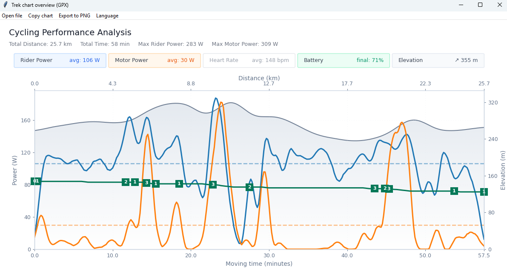
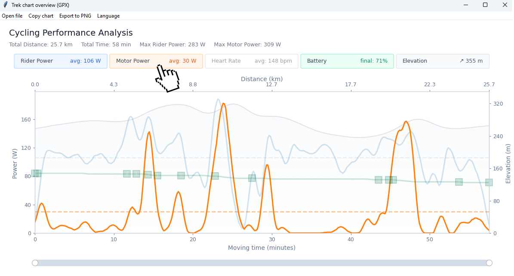

# Trek Ride Snapshot 🚴⚡📈

**All your Trek ride metrics, in one chart.**  

Open a GPX exported from the Trek app and instantly get a clean, shareable chart with **rider power**, **motor power**, **battery**, **heart rate**, **distance**, **moving time**, and an **elevation profile** — all in one place.

> Desktop tool built with **Tkinter + Matplotlib**.

---

## ✨ Features

- ⚡ Rider vs motor power with smoothing (easy to read, less noise)
- ⛰️ Elevation profile as a subtle background layer
- ⏱️ Moving time (stops removed) on the main X-axis
- 🛣️ Distance (km) on the top X-axis
- 📉 Mean power lines for rider and motor
- 🔋 Battery line (when present)
- ❤️ Heart rate line (when present)
- 🧩 Assist level markers (mode changes shown along the battery line, when present)
- 🖱️ Legend hover highlight (dim everything else to focus)
- 📋 Copy chart to Windows clipboard
- 🖼️ Export to PNG
- 🌍 Multi-language UI from simple `*.json` translation files (remembers last language)
- 🧼 Click items in the **legend** to toggle visibility — you can hide/show any series to focus on what matters.
- 😅 Yes, I know there’s no **speed** — but it doesn’t play nicely with the ranges of the other metrics. This chart is designed first and foremost to compare **rider vs. motor power** (plus battery/HR/elevation) without squeezing everything into unreadable scales. Speed is better explored in a dedicated speed-focused view where it can have its own axis and smoothing rules.


---

## 🧠 How it works (overview)

- Resamples data every **10 seconds of active time**
- Applies smoothing:
  - Power: **7-point + 5-point moving average**
  - Elevation: light smoothing
  - Battery / HR: smoothed when present (with interpolation when needed)
- Detects assist-mode changes and collapses rapid toggles into a single final marker
- Detects long stops (≥ 60s with near-zero speed and both powers at 0) and removes them from *moving time*

---

## ✅ Requirements

- Python **3.x**
- Dependencies:
  - `matplotlib`
  - `numpy`

> Tkinter ships with Python on most desktop installs.

---

## 📦 Install

```bash
pip install matplotlib numpy
```

---

## ▶️ Run

```bash
python grafic.py
```

Steps:
1. Pick a `.gpx` file exported from the Trek app
2. The chart renders automatically
3. Use the top menu to:
   - Open another file
   - Copy chart (Windows clipboard)
   - Export PNG
   - Switch language

---

## 🖼️ Screenshots

**Default chart:**


--

**Dimmed sections on hover legend**


---

## 🌍 Translations

Translations live next to `grafic.py` as `*.json`.

Add a new language:
1. Copy an existing file (e.g. `en.json`)
2. Rename it (e.g. `fr.json`)
3. Translate the values
4. Run the app and pick it from the **Language** menu

The last selected language is saved to `last_language.json`.

---

## 📁 Repo structure

```text
.
├─ grafic.py                # main script
├─ README.md                # this file
├─ en.json                  # engligh translation
├─ ca.json                  # catalan translation
└─ last_language.json       # auto-generated, remembers last selected language
```

---

## 🤝 Contributing

- 🐞 **Issues & PRs:** open an issue or submit a PR with improvements or fixes.
- 🌍 **Translations:** add a new language by creating a `*.json` file with the UI keys (tip: copy `en.json` as a starting point).
- 🧾 **Bug reports:** include your **OS**, **Python version**, and the full **error/traceback** if available.
- 🧩 **GPX parsing issues:** share a **redacted** GPX snippet that reproduces the problem (and note which fields are missing: `power`, `motor`, `battery`, `hr`).

---

## 🪟 Clipboard note (Windows)

“Copy chart” uses Windows clipboard APIs via `ctypes` and copies as **CF_DIB** (bitmap).  
On macOS/Linux this may not work — use **Export to PNG** instead.

---

## ⚠️ Disclaimer

This project is provided **as-is**, without warranty.  
Not affiliated with or endorsed by Trek.
